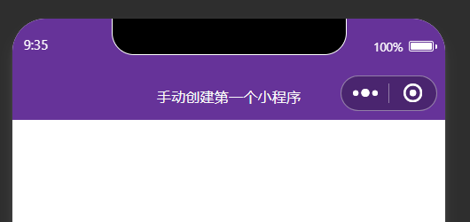
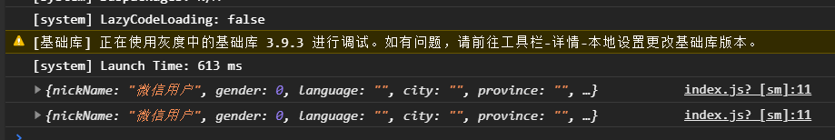

# 2022年夏季《移动软件开发》Lab1实验报告


## **一、实验目标**

1、学习使用快速启动模板创建小程序的方法；2、学习不使用模板手动创建小程序的方法。

## 二、实验步骤

1. 实验准备：在微信公众平台上注册好开发者账号，并下载微信开发者工具，开始实验。
2. 创建项目：在微信公众平台上获取自己的appID，选择不使用云开发，选择Javascript开发语言，初始化项目。
3. 删除和修改文件：
   将 app.json 文件内 pages 属性中的“pages/logs/logs”删除,并删除上一行末尾的逗号
   删除 utils 文件夹及其内部所有内容
   删除 pages 文件夹下的 logs 目录及其内部所有内容
   删除 index.wxml和 index.wxss 中的全部代码
   删除 index.js 中的全部代码,并且输人关键词“page”找到第二个选项按回车键让其自动补全函数
   删除 app.wxss 中的全部代码
   删除 app.js 中的全部代码,并且输入关键词“app”找到第一个选项按回车键让其自动补全函数
   按 Ctrl+S 保存当前修改
4. 导航栏设计：在app.json中对window属性重新配置，实现自定义的导航栏效果
   修改代码如下：

```json
	"window": {
    "navigationBarBackgroundColor": "#663399",
    "navigationBarTitleText": "手动创建第一个小程序",
    "navigationBarTextStyle": "white"
  }
```

效果如图：



5. 页面设计：

index.wxml管理页面内容有什么，在这部分使用image组件显示微信头像；text组件显示微信昵称；button组件实现按钮。此外，为了使用动态数据显示头像和昵称，使用双花括号’{{}}'形式，实现动态获取。修改代码如下：

```html
<view class="container">
  <image src="{{src}}" mode="widthFix"></image>
  <text>{{name}}</text>
  <button bindtap="getMyInfo">
  点击获取头像和昵称
  </button>
</view>
```

index.js负责页面逻辑的实现，为了用动态数据显示头像和昵称，需要在index.js中的data属性中，写入这两个动态数据的值。其中images为自己创建的用来存放图片的文件夹，weixin.jpg是自己找的微信logo。补充后的data代码如下：

```js
data: {
    src:'/images/weixin.jpg',
    name:'Hello World'
  },
```

index.wxss用于修改页面样式，通过类选择器，实现index页面的整体flex布局；通过标签选择器，修改image和text的样式。代码如下：

```css
/* 样式 */
.container{
  height: 100vh;
  display: flex;
  flex-direction: column;
  align-items: center;
  justify-content: space-around;
}
image{
  width: 400rpx;
  border-radius: 50%;
}
text{
  font-size: 50rpx;
  color: red;
}
```

之后再修改获取用户信息相关代码，修改index.js和app.json：

```JS
Page({
  data: {
    src: '/images/weixin.jpg',
    name: 'Hello World'
  },

  getMyInfo:function(){
    wx.getUserProfile({
      desc: '用于展示用户信息',
      success: (res) => {
        console.log(res.userInfo);
        //更新页面数据
        this.setData({
          src:res.userInfo.avatarUrl,
          name:res.userInfo.nickName
        });
      },
      fail: (err) => {
        console.log("获取失败", err);
      }
    })
  },
})
```


## 三、程序运行结果

最后运行如图：



获取成功

## 四、问题总结与体会

对项目结构与配置的理解更清晰。通过分别实践“用模板创建”和“纯手动创建”两种方式，我把小程序项目的基本骨架理顺了：app.json 负责全局路由与窗口外观，app.js 处理全局生命周期，app.wxss 放全局样式，pages 目录下每个页面再有自己独立的 wxml/js/wxss/json。手动精简模板文件、逐条修改 app.json 的过程，能有效帮助理解哪些配置是“必需的”，哪些是“可有可无的”。

对 JSON 配置的严谨性有直观认识。删除 pages/logs/logs 路由时，如果不小心漏删上一行末尾逗号，会直接导致编译错误。这让我意识到构建工具对 JSON 语法的严格校验，以及“配置错误往往比代码错误更隐蔽”，今后会养成改配置后立即保存、看控制台报错的习惯。

这个实验虽小，但覆盖了项目初始化、配置、布局、事件、权限与数据绑定等关键环节，帮助我把分散的概念串成了可运行的样例。后续我会在此基础上尝试抽离组件、引入简单的接口请求，尽早形成“页面—状态—服务”的开发闭环。总体来说，Lab1 达到了“搭脚手架、夯基础”的目的。