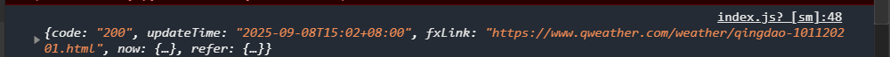

# 2022年夏季《移动软件开发》Lab2实验报告


## **一、实验目标**

1、学习使用快速启动模板创建小程序的方法；2、学习不使用模板手动创建小程序的方法。

## 二、实验步骤

1.准备工作

在和风开发控制台创建项目，得到个人KEY，并配置服务器域名


2. 导入天气图标等给定的图片素材


3.视图设计

- 导航栏设计：修改app.json中的导航栏样式

```json
{
  "pages": [
    "pages/index/index"
  ],
  "window": {
    "navigationBarBackgroundColor": "#3883FA",
    "navigationBarTitleText": "今日天气",
    "navigationBarTextStyle": "white"
  },
  "networkTimeout": {
    "request": 10000
  }
}
```

- 页面设计：将页面分为4个区域：地区选择器（picker组件）；显示当前城市的温度和天气状况的文字说明；天气图标；分多行显示湿度、气压等其他天气信息。整体使用嵌套view组件实现，wxss样式使用flex布局实现。index.wxss代码如下：

  ```css
  /* 地区选择器样式 */
  picker {
    width: 100%;
    text-align: center;
    padding: 20rpx;
  }
  
  .picker {
    font-size: 36rpx;
    color: #333;
    padding: 20rpx;
    background-color: #fff;
    border-radius: 10rpx;
    box-shadow: 0 4rpx 12rpx rgba(0, 0, 0, 0.1);
  }
  
  /* 天气文本样式 */
  .weather-text {
    font-size: 80rpx;
    color: #3C5F81;
    font-weight: bold;
    text-align: center;
    margin: 20rpx 0;
  }
  
  /* 天气图标样式 */
  .weather-icon {
    width: 220rpx;
    height: 220rpx;
  }
  
  /* 详情区域样式 */
  .detail {
    width: 100%;
    display: flex;
    flex-direction: column;
    background-color: #fff;
    border-radius: 20rpx;
    padding: 30rpx;
    box-shadow: 0 4rpx 12rpx rgba(0, 0, 0, 0.1);
    box-sizing: border-box;
  }
  
  /* 行样式 */
  .bar {
    display: flex;
    flex-direction: row;
    margin: 20rpx 0;
  }
  
  /* 单元格样式 */
  .box {
    width: 33.3%;
    text-align: center;
    font-size: 32rpx;
    color: #333;
  }
  
  .box:nth-child(1) {
    text-align: left;
  }
  
  .box:nth-child(3) {
    text-align: right;
  }
  ```

  4. 逻辑设计

  - 更新地区信息：为picker组件追加自定义bindchange事件，监听选项变化;在JS文件的data中定义region包含初始城市信息;定义regionChange函数更新城市信息及对应天气信息。
  - 获取实况天气数据：调用GeoAPI来获取LocationID，然后使用该LocationID请求天气信息。具体代码如下：

  ```js
  Page({
    data: {
      region:['山东省','青岛市','黄岛区'],
      locationId:'', //初始化为空
    },
    regionChange:function(e){
      this.setData({region:e.detail.value});
      this.getLocationIdAndWeather();
    },
  
    //定义getLocationIdAndWeather函数调用GeoAPI，根据城市名称获取对应的LocationID。成功获取LocationID后，将其保存在 locationId中，并调用getWeather函数来获取天气信息
   getLocationIdAndWeather:function(){
    var that = this;
    wx.request({
      url: 'https://geoapi.qweather.com/v2/city/lookup?',
      data:{
        location:that.data.region[1],
        key:'a7e20169641040e29b3f2235a730e894'
      },
      success:function(res){
        if(res.data.code === "200" && res.data.location.length > 0){
          that.setData({
            locationId:res.data.location[0].id
          });
          that.getWeather();
        }
        else{
          console.log("获取LocationId失败");
        }
      },
      fail:function(err){
        console.log("请求失败",err);
      }
    });
  },
  
  //getWeather函数使用获取到的LocationID进行天气查询，并在控制台输出天气信息
  //通过控制台信息，可以看到返回的天气信息存储到now数据对象中，获取成功。然后更新getWeather函数，将数据存到JS文件的data中
  getWeather:function(){
    var that = this;
    wx.request({
      url: 'https://devapi.qweather.com/v7/weather/now?',
      data:{
        location:that.data.locationId,
        key:'a7e20169641040e29b3f2235a730e894'
      },
      success:function(res){
        console.log(res.data);
        that.setData({now:res.data.now});
      },
      fail:function(err){
        console.log("获取天气信息失败",err);
      }
    });
  },
  
  //生命周期函数--监听页面加载
  //在页面加载时获取LocationID和天气信息
  onLoad: function (options) {
    this.getLocationIdAndWeather();
  },
  });
  ```

  控制台信息输出如下：

  

  - 更新页面天气信息：将index.wxml页面上的所有临时数据都替换为{{now.属性}}形式，实现动态更新天气信息。完整的index.wxml代码如下：

    ```html
    <view class="container">
      <picker mode="region" bindchange="regionChange">
        <view>{{region}}</view>
      </picker>
      <text>{{now.temp}}℃{{now.text}}</text>
      <image src="/images/weather_icon_s1_bw/{{now.icon}}.svg" mode="widthFix"></image>
      <view class="detail">
        <view class="bar">
          <view class="box">湿度</view>
          <view class="box">气压</view>
          <view class="box">能见度</view>
        </view>
        <view class="bar">
          <view class="box">{{now.humidity}} %</view>
          <view class="box">{{now.pressure}} hPa</view>
          <view class="box">{{now.vis}} km</view>
        </view>
        <view class="bar">
          <view class="box">风向</view>
          <view class="box">风速</view>
          <view class="box">风力</view>
        </view>
        <view class="bar">
          <view class="box">{{now.windDir}}</view>
          <view class="box">{{now.windSpeed}} km/h</view>
          <view class="box">{{now.windScale}} 级</view>
        </view>
      </view>
    </view>
    ```

    

## 三、程序运行结果

程序界面：


## 四、问题总结与体会

本次实验在完成从项目初始化到界面与逻辑联调的完整闭环中，加深了对小程序开发与和风天气API使用的理解：通过GeoAPI先检索LocationID再查询实况，解决了直接用中文地名导致的参数无效问题；在路径与Host上严格对齐控制台配置，避免了404与403等常见错误；前端以picker触发城市切换，数据用now对象双向驱动视图，配合flex样式实现清晰的模块化布局。总体收获是：先打通“最小可用链路”，再逐步完善细节；同时保持对文档版本（v1/v2错误码）和平台规范的敏感，能显著提升排错效率与开发稳定性。