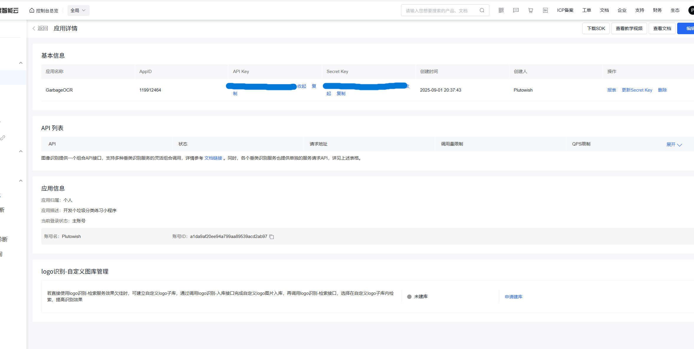
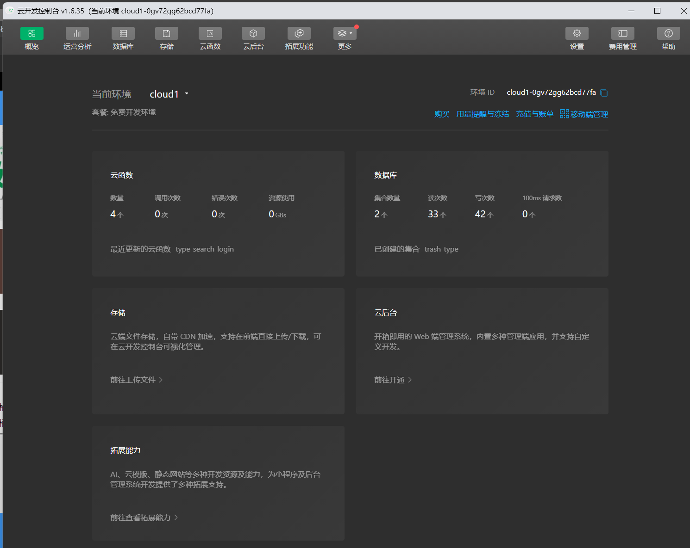
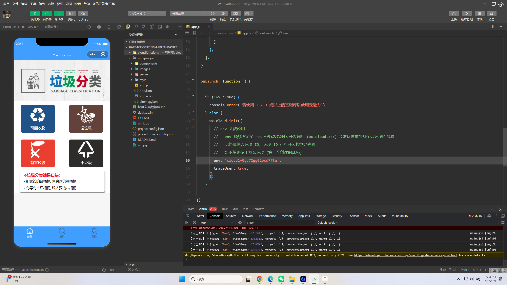
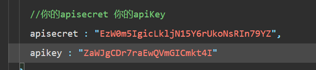
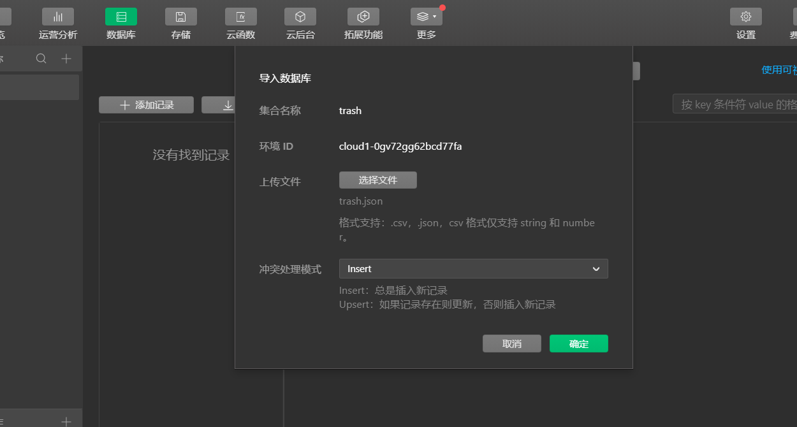
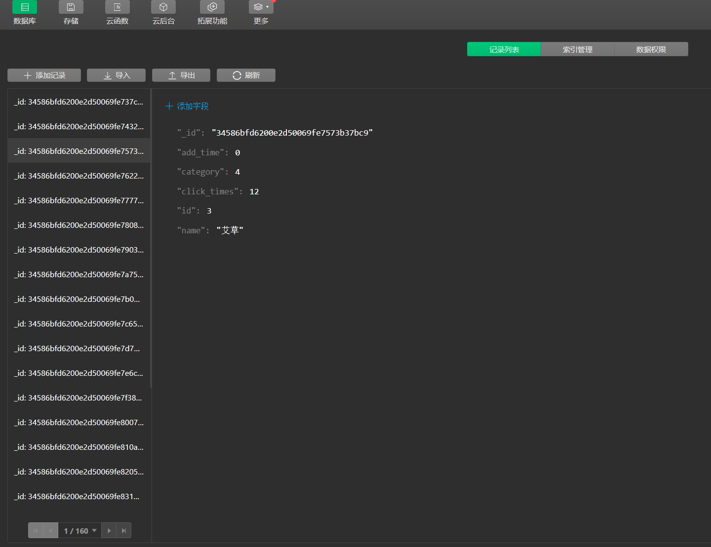
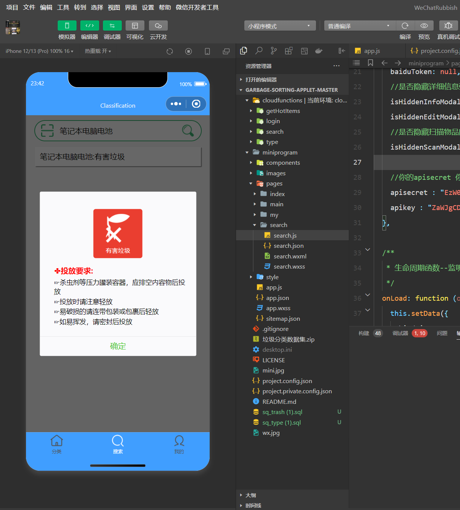

# 2025年夏季《移动软件开发》Lab1实验报告

## **一、实验目标**

学习微信小程序云开发的基础知识。能够完成利用文本搜索的功能就好，图像识别、语音识别接口有时有问题，不强求。

## 二、实验步骤

1.用百度智能云申请一个需要的图像识别api

2.用微信开发者工具建云环境

3.按要求添加百度KEY和云环境ID

4.按照要求将指定函数上传为云函数后，在云开发中创建trash和type的集合并导入对应的json文件：

全部导入后小程序的云开发与部署彻底成功！

## 三、程序运行结果

尝试运行小程序效果如图：

图片识别搜索也能正常运行，发现实验进行的很成功！

## 四、问题总结与体会

### 实验中遇到的问题

1. **云函数部署问题**
    部署云函数后发现调用时没有反应，结果是因为云函数没完全部署好，触发器也没设置对。后来重新检查了一下触发器设置，确认是 HTTP 触发器的问题，重新部署后才正常运行。
2. **云数据库连接失败**
    在实验中，云函数调用数据库时一直报错，后来才发现是数据库的 IP 白名单没有加云函数的环境地址。加上白名单后，数据库连接才正常。
3. **图像识别接口无响应**
    上传图片后没反应，检查了半天才发现是百度云图像识别的应用配置时权限没开全，少选了几个 API 权限。重新配置权限后，调用接口就正常了。

### 总结

通过这次实验，我对云函数、云数据库和图像识别工具的使用有了更深的了解。虽然过程中遇到了一些问题，但解决问题的过程让我更加熟悉云开发的各种细节。实验中踩的坑也给了我很多启发，比如部署时一定要仔细检查配置，尽量避免低级错误。