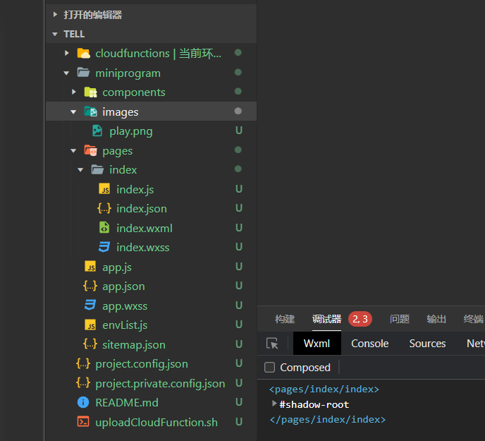
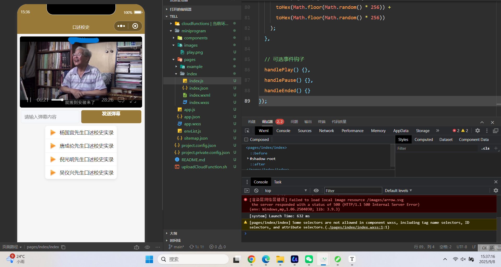

# 2022年夏季《移动软件开发》Lab4实验报告


## **一、实验目标**

1、掌握视频API的操作方法；2、掌握如何发送随机颜色的弹幕。

## 二、实验步骤

1.前期准备：创建项目，删除和修改文件，创建images文件夹，保存播放图标文件，完成文件配置



## 二、实验步骤

1. 前期准备

- 使用微信开发者工具创建项目；删除模板无关文件；创建 images 目录并引入播放图标 play.png（来自提供的素材包）；配置 app.json 的 window 属性。
- 将四个视频地址配置到页面 JS 的 list 数组（来自实验文档）。

1. 视图设计

- 导航栏设计：

```json
"window": {
  "navigationBarTitleText": "口述校史",
  "navigationBarBackgroundColor": "#987938",
  "navigationBarTextStyle": "white"
}
```

- 页面分区：
  - 视频播放器（video，开启 controls、autoplay、enable-danmu、danmu-btn）；
  - 弹幕输入与发送区（input + button）；
  - 视频列表（view 列表，使用 wx:for 渲染，每行含播放图标与标题）。
- 使用 flex 布局与卡片化样式，保证在手机端良好的视觉层次与可点按性。

1. 逻辑实现

- 更新播放列表：在 wxml 中对 list 使用 wx:for 渲染；在 data 中维护包含 id、title、videoUrl 的数组（四段“口述校史”视频）。
- 点击播放视频：列表项绑定 data-url 与 bind:tap="playVideo"；onLoad 中创建视频上下文 this.videoCtx；playVideo 中先 this.videoCtx.stop() 再 setData({src}) 并调用 this.videoCtx.play()，避免两个视频同时播放造成声音重叠。
- 发送弹幕：为 video 组件开启 enable-danmu 和 danmu-btn；在 input 上 bindinput="getDanmu"，button 上 bind:tap="sendDanmu"；sendDanmu 中调用 this.videoCtx.sendDanmu({ text, color: this.getRandomColor() })；getRandomColor 通过随机 0-255 的 RGB 转十六进制生成颜色。

核心代码摘录：

- 列表项与点击：

```xml
<view class="videoBar" wx:for="{{list}}" wx:key="video{{index}}" data-url="{{item.videoUrl}}" bind:tap="playVideo">
  <image src="/images/play.png"></image>
  <text>{{item.title}}</text>
</view>
```

- 播放控制与上下文：

```js
onLoad() {
  this.videoCtx = wx.createVideoContext('myVideo')
},
playVideo(e) {
  this.videoCtx.stop()
  this.setData({ src: e.currentTarget.dataset.url })
  this.videoCtx.play()
}
```

- 弹幕区域与发送：

```xml
<view class="danmuArea">
  <input type="text" placeholder="请输入弹幕内容" bindinput="getDanmu" />
  <button bind:tap="sendDanmu">发送弹幕</button>
</view>
getDanmu(e){
  this.setData({ danmuTxt: e.detail.value })
},
sendDanmu(){
  const text = this.data.danmuTxt
  this.videoCtx.sendDanmu({
    text,
    color: this.getRandomColor()
  })
},
getRandomColor(){
  let rgb = []
  for(let i = 0; i < 3; ++i){
    let color = Math.floor(Math.random() * 256).toString(16)
    color = color.length === 1 ? '0' + color : color
    rgb.push(color)
  }
  return '#' + rgb.join('')
}
```

## 三、程序运行结果

- 进入页面后默认自动播放列表首个视频；
- 点击列表任意条目可切换视频且不卡顿，无双源叠音；
- 输入弹幕文本后点击“发送弹幕”，可在视频上方实时看到随机颜色弹幕滚动显示；
- UI 分区清晰，列表滚动与按钮交互正常。



## 四、问题总结与体会

- 问题定位：最初弹幕颜色未生效，原因是误将 color 赋值为字符串 "getRandomColor()"；修正为 this.getRandomColor() 后正常。切换视频时出现声音重叠，通过在切换前调用 this.videoCtx.stop() 彻底解决。
- 开发体会：video 上下文管理与事件时序非常关键；发送弹幕需确保组件参数开启并正确调用 API；良好的列表数据结构与事件绑定能显著降低业务复杂度。通过本实验进一步熟悉了媒体 API 的使用与小程序交互逻辑编写。
