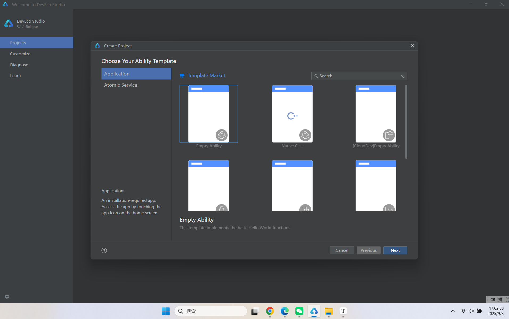
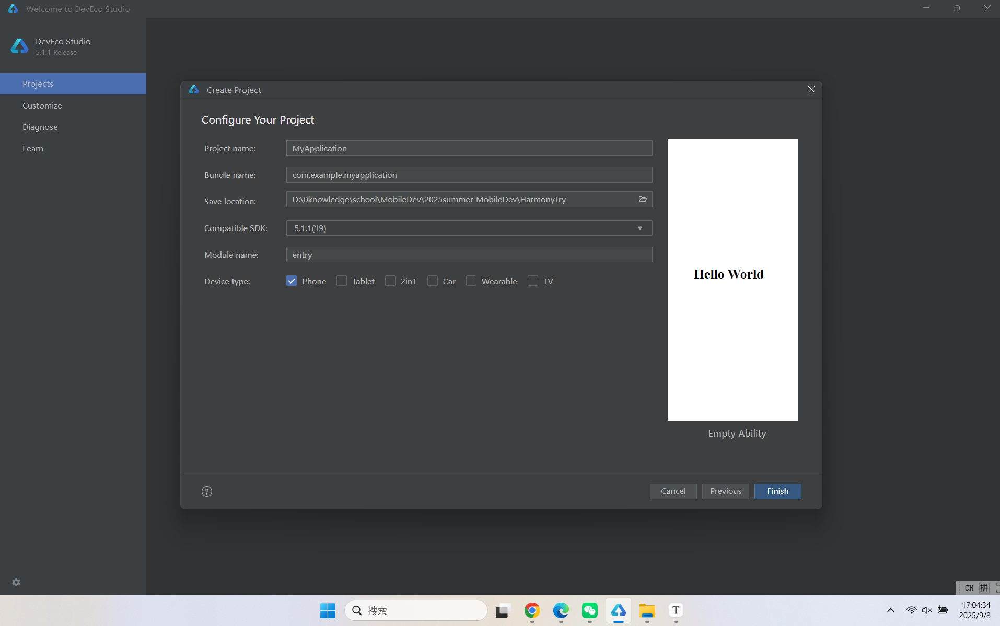
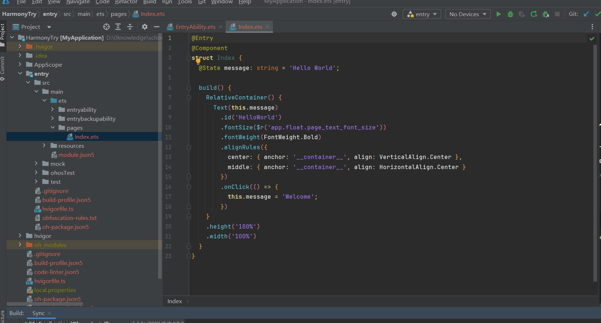
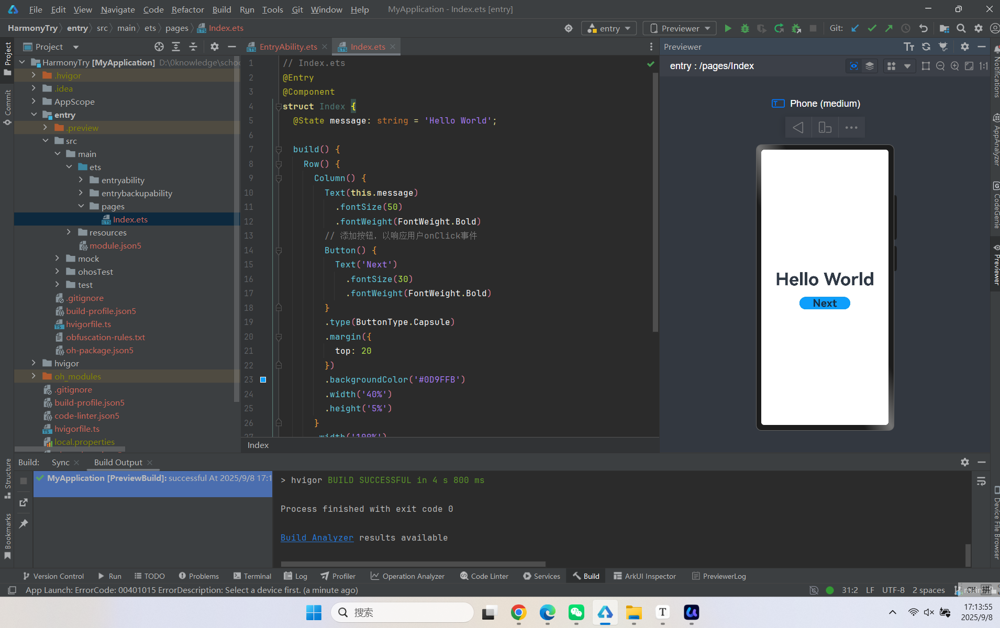
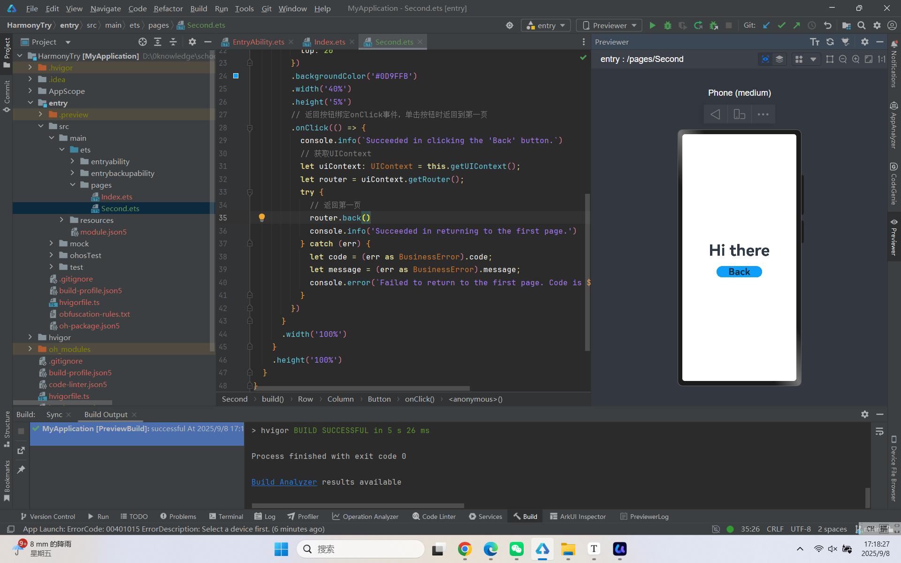
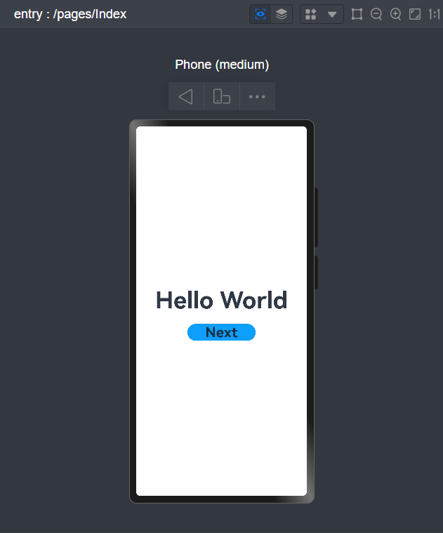

# 2022年夏季《移动软件开发》Lab5实验报告


## **一、实验目标**

 1、掌握如何构建 HarmonyOS应用；2、掌握应用程序包结构、资源文件的使用；3、掌握ArkTS的核心功能和语法等基础知识，为后续的应用开发奠定基础。

## 二、实验步骤

### 1. 准备阶段

先下载开发鸿蒙应用所需的DevEco软件，然后创建一个空的新工程





创建成功后即可看到左侧的ArkTS工程目录结构



根据实验文档得知上图中各文件的作用

### 2. 构建第一个页面

entry -> src -> main -> ets -> pages，打开`Index.ets`文件，将页面从`RelativeContainer`相对布局修改成`Row/Column`线性布局，代码如下：

```
// Index.ets
@Entry
@Component
struct Index {
@State message: string = 'Hello World';

    build() {
        Row() {
        Column() {
            Text(this.message)
            .fontSize(50)
            .fontWeight(FontWeight.Bold)
        }
        .width('100%')
        }
        .height('100%')
    }
}
```

在默认页面基础上，添加一个`Button`组件，作为按钮响应用户onClick事件，从而实现跳转到另一个页面。Index.ets文件的示例如下：

```
// Index.ets
@Entry
@Component
struct Index {
@State message: string = 'Hello World';

    build() {
        Row() {
        Column() {
            Text(this.message)
            .fontSize(50)
            .fontWeight(FontWeight.Bold)
            // 添加按钮，以响应用户onClick事件
            Button() {
            Text('Next')
                .fontSize(30)
                .fontWeight(FontWeight.Bold)
            }
            .type(ButtonType.Capsule)
            .margin({
            top: 20
            })
            .backgroundColor('#0D9FFB')
            .width('40%')
            .height('5%')
        }
        .width('100%')
        }
        .height('100%')
    }
}
```

此时预览效果如图：



### 3. 构建第二个页面

新建第二个页面文件。在Project窗口，打开entry -> src -> main -> ets，右键单击pages文件夹，选择New -> ArkTS File，命名为Second，单击回车键。配置第二个页面的路由。在Project窗口，打开entry > src > main > resources > base > profile，在main_pages.json文件中的"src"下配置第二个页面的路由"pages/Second"。示例如下：

```
{
"src": [
    "pages/Index",
    "pages/Second"
]
}
```

参考第一个页面，在第二个页面添加Text组件、Button组件等，并设置其样式。Second.ets文件的示例如下：

```
// Second.ets
@Entry
@Component
struct Second {
@State message: string = 'Hi there';

    build() {
        Row() {
        Column() {
            Text(this.message)
            .fontSize(50)
            .fontWeight(FontWeight.Bold)
            Button() {
            Text('Back')
                .fontSize(30)
                .fontWeight(FontWeight.Bold)
            }
            .type(ButtonType.Capsule)
            .margin({
            top: 20
            })
            .backgroundColor('#0D9FFB')
            .width('40%')
            .height('5%')
        }
        .width('100%')
        }
        .height('100%')
    }
}
```

### 4. 实现页面间的跳转

- 页面间的导航可以通过页面路由router来实现。页面路由router根据页面url找到目标页面，从而实现跳转。使用页面路由导入**router**模块。在第一个页面中，跳转按钮绑定onClick事件，单击按钮时跳转到第二页。Index.ets文件的示例如下：

  ```
  // Index.ets
  import { BusinessError } from '@kit.BasicServicesKit';
  
  @Entry
  @Component
  struct Index {
  @State message: string = 'Hello World';
  
      build() {
          Row() {
          Column() {
              Text(this.message)
              .fontSize(50)
              .fontWeight(FontWeight.Bold)
              // 添加按钮，以响应用户onClick事件
              Button() {
              Text('Next')
                  .fontSize(30)
                  .fontWeight(FontWeight.Bold)
              }
              .type(ButtonType.Capsule)
              .margin({
              top: 20
              })
              .backgroundColor('#0D9FFB')
              .width('40%')
              .height('5%')
              // 跳转按钮绑定onClick事件，单击时跳转到第二页
              .onClick(() => {
              console.info(`Succeeded in clicking the 'Next' button.`)
              // 获取UIContext
              let uiContext: UIContext = this.getUIContext();
              let router = uiContext.getRouter();
              // 跳转到第二页
              router.pushUrl({ url: 'pages/Second' }).then(() => {
                  console.info('Succeeded in jumping to the second page.')
  
              }).catch((err: BusinessError) => {
                  console.error(`Failed to jump to the second page. Code is ${err.code}, message is ${err.message}`)
              })
              })
          }
          .width('100%')
          }
          .height('100%')
      }
  }
  ```

  ##### 若是需要第二个页面返回到第一个页面

  - 在第二个页面中，返回按钮绑定onClick事件，单击按钮时返回到第一页。Second.ets文件的示例如下：

  ```
  // Second.ets
  import { BusinessError } from '@kit.BasicServicesKit';
  
  @Entry
  @Component
  struct Second {
  @State message: string = 'Hi there';
  
      build() {
          Row() {
          Column() {
              Text(this.message)
              .fontSize(50)
              .fontWeight(FontWeight.Bold)
              Button() {
              Text('Back')
                  .fontSize(30)
                  .fontWeight(FontWeight.Bold)
              }
              .type(ButtonType.Capsule)
              .margin({
              top: 20
              })
              .backgroundColor('#0D9FFB')
              .width('40%')
              .height('5%')
              // 返回按钮绑定onClick事件，单击按钮时返回到第一页
              .onClick(() => {
              console.info(`Succeeded in clicking the 'Back' button.`)
              // 获取UIContext
              let uiContext: UIContext = this.getUIContext();
              let router = uiContext.getRouter();
              try {
                  // 返回第一页
                  router.back()
                  console.info('Succeeded in returning to the first page.')
              } catch (err) {
                  let code = (err as BusinessError).code; 
                  let message = (err as BusinessError).message; 
                  console.error(`Failed to return to the first page. Code is ${code}, message is ${message}`)
              }
              })
          }
          .width('100%')
          }
          .height('100%')
      }
  }
  ```

  

## 三、程序运行结果

最终两个页面运行结果如图：




## 四、问题总结与体会

本次 Lab5 通过在 DevEco Studio 中从零构建 HarmonyOS 应用，完成了两个页面的创建与样式搭建，掌握了 ArkTS 基础语法、Row/Column 线性布局使用，以及通过 UIContext 路由进行页面跳转与返回的流程；在实践中进一步理解了工程目录、资源配置与 main_pages.json 路由声明的关系，熟悉了按钮事件绑定与日志调试方法。整体体验是：鸿蒙应用开发的工程化与路由机制清晰，ArkTS 的声明式 UI 易于上手，但也需要在组件属性、事件与页面生命周期的配合上保持规范与一致，后续可在状态管理、组件复用与主题样式上做更系统化的沉淀。
