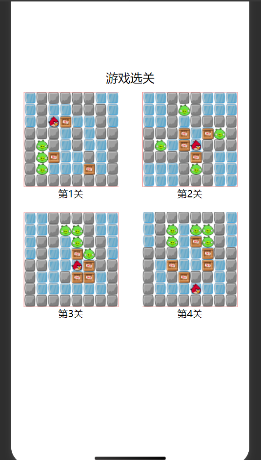
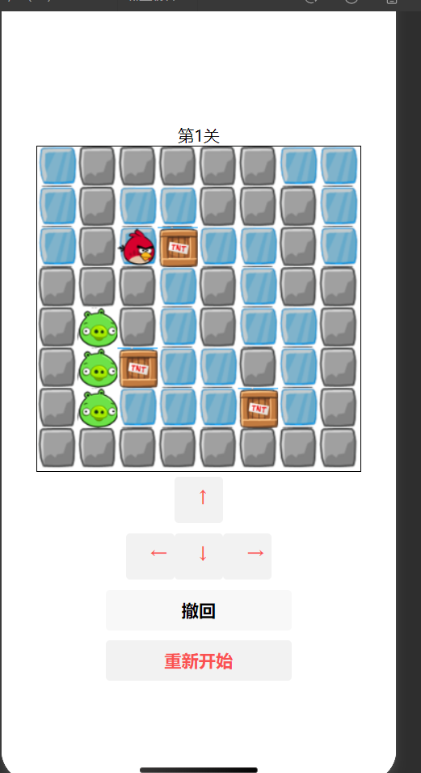
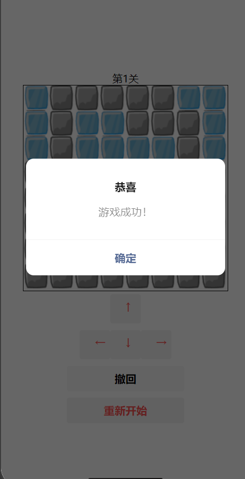

# 2022年夏季《移动软件开发》Lab6实验报告


## **一、实验目标**

1、综合所学知识创建完整的推箱子游戏；2、能够在开发过程中熟练掌握真机预览、调试等操作。


## 二、实验步骤

### 1. 页面配置

- 新建小程序项目 boxGame，创建 index（首页）与 game（游戏页）。
- 新增目录：
  - images/icons：bird.png、box.png、ice.png、pig.png、stone.png
  - utils：data.js（关卡公共数据）
- 调整 app.json 导航栏：

```json
{
  "pages": [
    "pages/index/index",
    "pages/game/game"
  ],
  "window": {
    "navigationBarTextStyle": "black",
    "navigationBarTitleText": "推箱子游戏",
    "navigationBarBackgroundColor": "#ffffff"
  },
  "style": "v2",
  "componentFramework": "glass-easel",
  "sitemapLocation": "sitemap.json",
  "lazyCodeLoading": "requiredComponents"
}
```

### 2. 公共样式

在 app.wxss 设置通用容器与标题样式：

```css
/**app.wxss**/
.container {
  height: 100%;
  display: flex;
  flex-direction: column;
  align-items: center;
  justify-content: space-between;
  padding: 200rpx 0;
  box-sizing: border-box;
} 

```

### 3. 首页设计（index.wxml）

```xml
<!--index.wxml-->
<!--pages/menu/menu.wxml-->
<view class='container'>
  <!-- 标题 -->
  <view class='title'>游戏选关</view>
  <!-- 关卡列表 -->
  <view class='levelBox'>
    <view class='box' wx:for='{{levels}}' wx:key='index' bindtap='chooseLevel' data-level='{{index}}'>
      <image src='/images/{{item}}'></image>
      <text>第{{index+1}}关</text>
    </view>
  </view>
</view>
```

### 4. 游戏页设计（game.wxml）

```xml
<!--pages/game/game.wxml-->
<!--game.wxml-->
<view class='container'>
  <!-- 关卡提示 -->
  <view class='title'>第{{level}}关</view>

  <!-- 游戏画布 -->
  <canvas canvas-id='myCanvas'></canvas>

  <!-- 方向键 -->
  <view class='btnBox'>
    <button type='warn' bindtap='up'>↑</button>
    <view>
      <button type='warn' bindtap='left'>←</button>
      <button type='warn' bindtap='down'>↓</button>
      <button type='warn' bindtap='right'>→</button>
    </view>
  </view>
  <button  bindtap="restoreState">撤回</button>
  <!-- 重新开始按钮 -->
  <button type='warn' bindtap='restartGame'>重新开始</button>
</view>

```

------

### 5. 逻辑实现（game.js）


```javascript
//game.js
var data = require('../../utils/data.js')
//地图图层数据
var map = [
  [0, 0, 0, 0, 0, 0, 0, 0],
  [0, 0, 0, 0, 0, 0, 0, 0],
  [0, 0, 0, 0, 0, 0, 0, 0],
  [0, 0, 0, 0, 0, 0, 0, 0],
  [0, 0, 0, 0, 0, 0, 0, 0],
  [0, 0, 0, 0, 0, 0, 0, 0],
  [0, 0, 0, 0, 0, 0, 0, 0],
  [0, 0, 0, 0, 0, 0, 0, 0]
]
//箱子图层数据
var box = [
  [0, 0, 0, 0, 0, 0, 0, 0],
  [0, 0, 0, 0, 0, 0, 0, 0],
  [0, 0, 0, 0, 0, 0, 0, 0],
  [0, 0, 0, 0, 0, 0, 0, 0],
  [0, 0, 0, 0, 0, 0, 0, 0],
  [0, 0, 0, 0, 0, 0, 0, 0],
  [0, 0, 0, 0, 0, 0, 0, 0],
  [0, 0, 0, 0, 0, 0, 0, 0]
]
//方块的宽度
var w = 40
//初始化小鸟的行与列
var row = 0
var col = 0

Page({

  /**
   * 页面的初始数据
   */
  data: {
    level: 1,
    history: []  // 用于存储游戏状态的历史记录
  },

  /**
   * 自定义函数--初始化地图数据
   */
  initMap: function(level) {
    // 读取原始的游戏地图数据
    let mapData = data.maps[level]
    //使用双重for循环记录地图数据
    for (var i = 0; i < 8; i++) {
      for (var j = 0; j < 8; j++) {
        box[i][j] = 0
        map[i][j] = mapData[i][j]

        if (mapData[i][j] == 4) {
          box[i][j] = 4
          map[i][j] = 2
        } else if (mapData[i][j] == 5) {
          map[i][j] = 2
          //记录小鸟的当前行和列
          row = i
          col = j
        }
      }
    }
  },
  /**
   * 自定义函数--绘制地图
   */
  drawCanvas: function() {
    let ctx = this.ctx
    //清空画布
    ctx.clearRect(0, 0, 320, 320)
    //使用双重for循环绘制8x8的地图
    for (var i = 0; i < 8; i++) {
      for (var j = 0; j < 8; j++) {
        //默认是道路
        let img = 'ice'
        if (map[i][j] == 1) {
          img = 'stone'
        } else if (map[i][j] == 3) {
          img = 'pig'
        }

        //绘制地图
        ctx.drawImage('/images/icons/' + img + '.png', j * w, i * w, w, w)

        if (box[i][j] == 4) {
          //叠加绘制箱子
          ctx.drawImage('/images/icons/box.png', j * w, i * w, w, w)
        }
      }
    }

    //叠加绘制小鸟
    ctx.drawImage('/images/icons/bird.png', col * w, row * w, w, w)

    ctx.draw()
  },

  /**
   * 自定义函数--方向键：上
   */
  up: function() {
    this.saveState(); 
    //如果不在最顶端才考虑上移
    if (row > 0) {
      //如果上方不是墙或箱子,可以移动小鸟
      if (map[row - 1][col] != 1 && box[row - 1][col] != 4) {
        //更新当前小鸟坐标
        row = row - 1
      }
      //如果上方是箱子
      else if (box[row - 1][col] == 4) {
        //如果箱子不在最顶端才能考虑推动
        if (row - 1 > 0) {
          //如果箱子上方不是墙或箱子
          if (map[row - 2][col] != 1 && box[row - 2][col] != 4) {
            box[row - 2][col] = 4
            box[row - 1][col] = 0
            //更新当前小鸟坐标
            row = row - 1
          }
        }
      }
      //重新绘制地图
      this.drawCanvas()
      //检查游戏是否成功
      this.checkWin()
    }
  },
  /**
   * 自定义函数--方向键：下
   */
  down: function() {
    this.saveState(); 
    //如果不在最底端才考虑下移
    if (row < 7) {
      //如果下方不是墙或箱子,可以移动小鸟
      if (map[row + 1][col] != 1 && box[row + 1][col] != 4) {
        //更新当前小鸟坐标
        row = row + 1
      }
      //如果下方是箱子
      else if (box[row + 1][col] == 4) {
        //如果箱子不在最底端才能考虑推动
        if (row + 1 < 7) {
          //如果箱子下方不是墙或箱子
          if (map[row + 2][col] != 1 && box[row + 2][col] != 4) {
            box[row + 2][col] = 4
            box[row + 1][col] = 0
            //更新当前小鸟坐标
            row = row + 1
          }
        }
      }
      //重新绘制地图
      this.drawCanvas()
      //检查游戏是否成功
      this.checkWin()
    }
  },
  /**
   * 自定义函数--方向键：左
   */
  left: function() {
    this.saveState(); 
    //如果不在最左侧才考虑左移
    if (col > 0) {
      //如果左侧不是墙或箱子,可以移动小鸟
      if (map[row][col - 1] != 1 && box[row][col - 1] != 4) {
        //更新当前小鸟坐标
        col = col - 1
      }
      //如果左侧是箱子
      else if (box[row][col - 1] == 4) {
        //如果箱子不在最左侧才能考虑推动
        if (col - 1 > 0) {
          //如果箱子左侧不是墙或箱子
          if (map[row][col - 2] != 1 && box[row][col - 2] != 4) {
            box[row][col - 2] = 4
            box[row][col - 1] = 0
            //更新当前小鸟坐标
            col = col - 1
          }
        }
      }
      //重新绘制地图
      this.drawCanvas()
      //检查游戏是否成功
      this.checkWin()
    }


  },
  /**
   * 自定义函数--方向键：右
   */
  right: function() {
    this.saveState(); 
    //如果不在最右侧才考虑右移
    if (col < 7) {
      //如果右侧不是墙或箱子,可以移动小鸟
      if (map[row][col + 1] != 1 && box[row][col + 1] != 4) {
        //更新当前小鸟坐标
        col = col + 1
      }
      //如果右侧是箱子
      else if (box[row][col + 1] == 4) {
        //如果箱子不在最右侧才能考虑推动
        if (col + 1 < 7) {
          //如果箱子右侧不是墙或箱子
          if (map[row][col + 2] != 1 && box[row][col + 2] != 4) {
            box[row][col + 2] = 4
            box[row][col + 1] = 0
            //更新当前小鸟坐标
            col = col + 1
          }
        }
      }
      //重新绘制地图
      this.drawCanvas()
      //检查游戏是否成功
      this.checkWin()
    }
  },


  /**
   * 自定义函数--判断游戏成功
   */
  isWin: function() {
    //使用双重for循环遍历整个数组
    for (var i = 0; i < 8; i++) {
      for (var j = 0; j < 8; j++) {
        //如果有箱子没在终点
        if (box[i][j] == 4 && map[i][j] != 3) {
          //返回假，游戏尚未成功
          return false
        }
      }
    }
    //返回真，游戏成功
    return true
  },

  /**
   * 自定义函数--游戏成功处理
   */
  checkWin: function() {
    if (this.isWin()) {
      wx.showModal({
        title: '恭喜',
        content: '游戏成功！',
        showCancel: false
      })
    }
  },

  /**
   * 自定义函数--重新开始游戏
   */
  restartGame: function() {
    wx.removeStorageSync('currentMap');
    wx.removeStorageSync('currentBox');
    wx.removeStorageSync('currentRow');
    wx.removeStorageSync('currentCol');
    wx.removeStorageSync('history');
    
    this.data.history = [];
    this.initMap(this.data.level - 1);
    this.drawCanvas();
  },
  

  onLoad: function(options) {
    // 加载保存的进度
    let savedMap = wx.getStorageSync('currentMap');
    let savedBox = wx.getStorageSync('currentBox');
    let savedRow = wx.getStorageSync('currentRow');
    let savedCol = wx.getStorageSync('currentCol');
    let savedHistory = wx.getStorageSync('history');
    
    if (savedMap && savedBox) {
      map = savedMap;
      box = savedBox;
      row = savedRow;
      col = savedCol;
      this.data.history = savedHistory || [];
    } else {
      // 如果没有保存的进度，就初始化地图
      let level = options.level;
      this.setData({
        level: parseInt(level) + 1
      });
      this.initMap(level);
    }
    
    this.ctx = wx.createCanvasContext('myCanvas');
    this.drawCanvas();
  },
  

  saveState: function() {
    // 将当前的地图状态、箱子状态和小鸟的位置保存到history栈中
    this.data.history.push({
      map: JSON.parse(JSON.stringify(map)),
      box: JSON.parse(JSON.stringify(box)),
      row: row,
      col: col
    });
  },
  
  restoreState: function() {
    if (this.data.history.length > 0) {
      let lastState = this.data.history.pop();
      map = JSON.parse(JSON.stringify(lastState.map));
      box = JSON.parse(JSON.stringify(lastState.box));
      row = lastState.row;
      col = lastState.col;
      this.drawCanvas();
    }
  },
  onUnload: function() {
    wx.setStorageSync('currentMap', map);
    wx.setStorageSync('currentBox', box);
    wx.setStorageSync('currentRow', row);
    wx.setStorageSync('currentCol', col);
    wx.setStorageSync('history', this.data.history);
  }
  
})
// 初始化地图数据
initMap:function(level){
  if (level < 0 || level >= data.maps.length) {
    console.error('Invalid level:', level);
    return;
  }
  let mapData = data.maps[level]
  for (var i = 0; i < 8; i++){
    for (var j = 0; j < 8; j++){
      box[i][j] = 0
      map[i][j] = mapData[i][j]
      if (mapData[i][j] == 4){      // 箱子
        box[i][j] = 4
        map[i][j] = 2
      } else if (mapData[i][j] == 5){ // 玩家
        map[i][j] = 2
        row = i
        col = j
      }
    }
  }
},

// 绘制地图
drawCanvas:function(){
  let ctx = this.ctx
  ctx.clearRect(0,0,320,320)
  for (var i=0;i<8;i++){
    for (var j=0;j<8;j++){
      let img = 'ice'
      if (map[i][j] == 1) img = 'stone'
      else if (map[i][j] == 3) img = 'pig'
      ctx.drawImage('/images/icons/' + img + '.png', j*w, i*w, w, w)
      if (box[i][j] == 4){
        ctx.drawImage('/images/icons/box.png', j*w, i*w, w, w)
      }
    }
  }
  ctx.drawImage('/images/icons/bird.png', col*w, row*w, w, w)
  ctx.draw()
}
```

## 四、程序运行结果

- 首页：展示关卡列表，点击进入。

  

- 游戏页：绘制棋盘与元素，方向键移动，支持重新开始，也有回退功能。

  

- 过关：全部箱子推至目标点后弹窗提示。



------

## 五、问题总结与体会

- 问题：data.js 中关卡行间缺逗号，导致跳转失败。
  - 解决：逐行校验关卡数组，补全分隔符。
- 体会：本次实验完成了基于微信小程序的推箱子游戏：搭建 index 与 game 两页，配置导航与通用样式，使用 utils/data.js 管理四关地图，Canvas 分层绘制地图、目标、箱子与玩家，实现四向移动、重新开始与通关判定，首页可选关进入；过程中统一素材路径到 /images/icons，修复了关卡数组漏逗号和基础库样式兼容问题，验证了真机运行效果；整体上加深了对小程序页面结构、Canvas 渲染与交互状态管理的理解，为后续加入撤回、存档、手势操作等优化奠定了良好基础。

